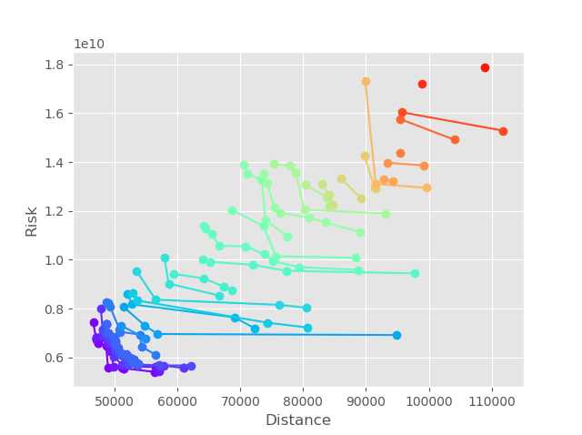
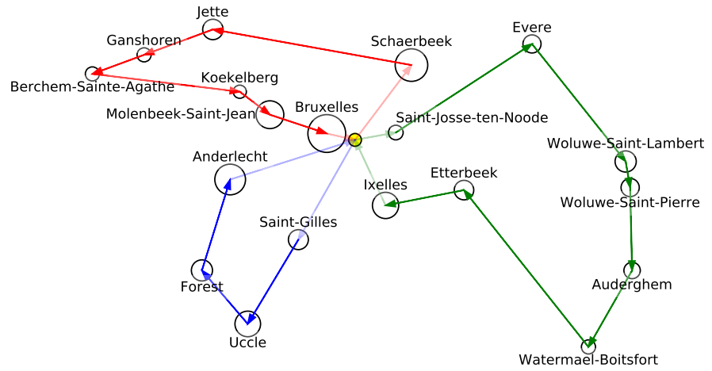

# GeneticTrucks

Implementation of NSGA-II genetic algorithm for optimising a multi-objective transportation problem.

## Screenshots




## General information

This project was an assignement for the course _Recherche opérationelle_ given at the _Ecole polytechnique de Bruxelles_ in third year of civil engineering. My team members were Darius Couchard and Jonathan Diangana who kindly allowed me to share our work.

### Problem description

Three truck collect money in the 19 municipalities of Brussels, their starting and ending point are the National Bank. The total distance and the "risk" have to be minimised. The risk is modelised as the transported money divided by the travelled distance **during the trip**.
Two constraints are added:
- A truck can never transport 50% of all the money to collect
- The 3 most populated municipalities can not be visited by the same truck

### Problem resolution

This problem was resolved by using a [genetic algorithm](https://en.wikipedia.org/wiki/Genetic_algorithm) called [NSGA-II](https://www.iitk.ac.in/kangal/Deb_NSGA-II.pdf). Our full report is available [here](https://drive.google.com/file/d/12RJlFtuxoevUXWdTxbeTFdsirHJer2rx/view?usp=sharing) (in French).

## Requirements

- Python 3
- Numpy
- Matplotlib
- Pickle

If you have python 3 installed you can type in a terminal:

```bash
python -m pip install numpy matplotlib pickle
```

## Setup

Download or clone the repository:

```bash
git clone https://github.com/rokowa/GeneticTrucks.git
```

## Usage

In the file `nsga2.py` are the simulation parameters :

```python
# NSGA2 Algorithm Parameters
INITIAL_POP = 25
MAX_SOLUTIONS = 100
NBR_ITERATIONS = 50
MUTATION_CHANCE = 0.1

X_SCALE_QUOTA = 1.0
Y_SCALE_QUOTA = 1.0
```

At the end of this file you can uncomment these lines :

```python
# saved_sol = open("saved_sol.bin", "wb")
# pickle.dump(final_solution_fronts, saved_sol)
# saved_sol.close()
```

This will save the solution as a serialized object in `saved_sol.bin`.

Then you can run the script:
```bash
python nsga2.py
```

This will perform the algorithm.

To visualize the best solution stored in `saved_sol.bin` you can run:
```bash
python representation.py
```

This will show the paths that minimize the total distance. To see the path which minimize risk, you can replace this line:
```python
#sort first front
front = sorted(sol[0], key=lambda chromosome: chromosome.get_fitness_score()[0])
```

By this one:
```python
#sort first front
front = sorted(sol[0], key=lambda chromosome: chromosome.get_fitness_score()[1])
```

Then run the script.

## Credits

My teammates :

Marius Couchard ([@GriffinBabe](https://github.com/GriffinBabe)) and Jonathan Diangana

## License

MIT License

Copyright &copy; 2020 Darius Couchard, Jonathan Diangana and Robin Kowalski

